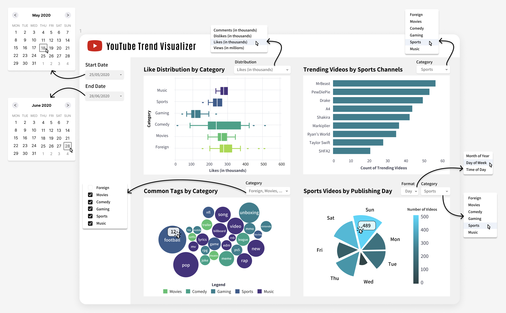

# 📹 Youtube Trend Analytics

Authors: Daniel Cairns, Natalie Cho, Lauren Zung

## Welcome!
Thanks for visiting our repository for our dashboard! This document (README.md) will have all the general information you need to know about our project. You can either scroll down or click from the links below to jump to a specific section:

* [Project Motivation](#project-motivation)
* [Dashboard Breakdown](#dashboard-features)
* [Dashboard Sketch](#dashboard-sketch)
* [Dataset Used](#dataset-used)
* [Getting Involved](#get-involved)

## Project Motivation

Why and how videos go viral on YouTube can seem random and unpredictable. For the growing number of content creators on the platform, understanding what makes a trending video is incredibly valuable. To support these creators, we propose to build a dashboard which highlights key information about trending YouTube videos over time. The social media video sharing platform combines multiple factors in their assessment of the top trending videos each calendar year; they are not just ranking videos based on their total number of views. By analyzing these metrics, creators can better understand trends within their category group(s) and strategically plan how to market and direct their channel accordingly to produce more trending videos.

## Dashboard Features

This dashboard is designed to deliver insights to YouTube content creators and enthusiasts on the top daily trending videos hosted by the platform. The visualization tool captures user interactions (likes, views, comments), publishing and trending dates, tag lists and more across tens of thousands of videos, with aims to have users interpolate their own understandings of YouTube's data using an effortless and engaging online interface.

The landing page gives users the ability to customize their viewing experience by adjusting the timeframe of interest using calendar widgets. This will adjust all charts on the web app to only illustrate data from videos that were trending between the chosen date settings. The four key visualizations are as follows:

**Category Boxplots**

Users can select via dropdown menu whether to plot the distribution of likes, comment or views across video categories. This provides an overview of different measures of popularity (including the median and interquartile range) for each group.

**Top Channels Bar Chart**

Creators may wish to see who the trendsetters were during a time period. A bar chart can capture the number of trending videos published by each top creator (by category, selected via menu), thus allowing users to determine where they stand in the lineup and/or find new sources of inspiration for their channel.

**Popular Tags Bubble Chart**

Dashboard visitors can observe common words and phrases in tag lists from numerous trending videos. A checklist menu will permit viewers to view tags from multiple categories so that they may integrate terms that are popular across communities to improve overall reach. To enhance data visibility, users can mouse over the bubbles to view a tooltip displaying the frequency of each tag by category.

**Publishing Date Circular Bar Chart**

A dropdown menu will provide options to customize the display to organize results by time of day, day of the week, or month of the year to highlight popular upload days/times on YouTube. This will enable users to make informed decisions about when to post to best increase their chances of having a viral video.

## Dashboard Sketch

Please click on the link below to access the sketch on Figma. More detailed mockups of the intended features are included in the image below.

[Figma Prototype](https://www.figma.com/proto/33iTnABTUz3DOoFkYiHiHU/Dashboard?node-id=1%3A2&scaling=scale-down&page-id=0%3A1&starting-point-node-id=1%3A2)



## Dataset Used

Youtube. (2023). <i>YouTube Trending Video Dataset (updated daily)</i> [Data set]. Kaggle. https://doi.org/10.34740/KAGGLE/DSV/5003820
Note: As we are based in Canada, we are using data extracted from videos that were trending in Canada due to file size limitations and for ease of loading/extraction. However, given the flexibility of our web app, it can be easily extended to YouTube data from other countries.

## Get involved

**How to run the app locally and make contributions**

If you would like to contribute to our project, please read the CONTRIBUTING.md file and then follow these steps:
- Ensure that you have R and Rstudio installed on your computer
- Fork our repository and clone it onto your computer
- Create a new branch (named according to the specifications in the CONTRIBUTING.md file)

*To run the app locally:*
- Open the project (i.e., the app.R file) in Rstudio 
- Ensure all the necessary packages are installed
```
install.packages(c("shiny", "bslib", "shinyWidgets", "shinydashboard", "ggplot2", "tidyverse", "forcats", "plotly", "thematic", "scales", "rlang", "stringr", "showtext", "sysfonts", "packcircles", "lubridate", "rsconnect"))
```
- Click "Run App"

*To propose new changes:*
- Make your changes to the code in Rstudio
- Commit your changes (with an informative commit message)
- Push your changes to your fork
- Submit a pull request 

**Places for improvement**
- Implement polar coordinate graph in ggplotly instead of ggplot2 for a more seamless dashboard integration
- Add a tooltip for polar coordinate graph to show count of videos per segment
- Distinguish between tooltip functionality for bubble graph
- Colour-code bubbles in bubble graph by category

## License

This dashboard is licensed under the terms of the [MIT license](LICENSE).
